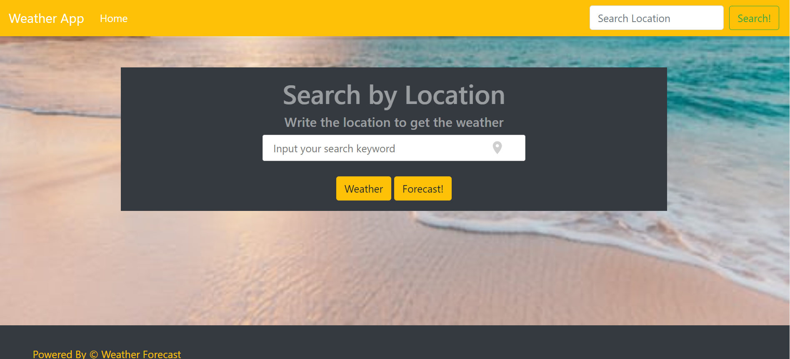
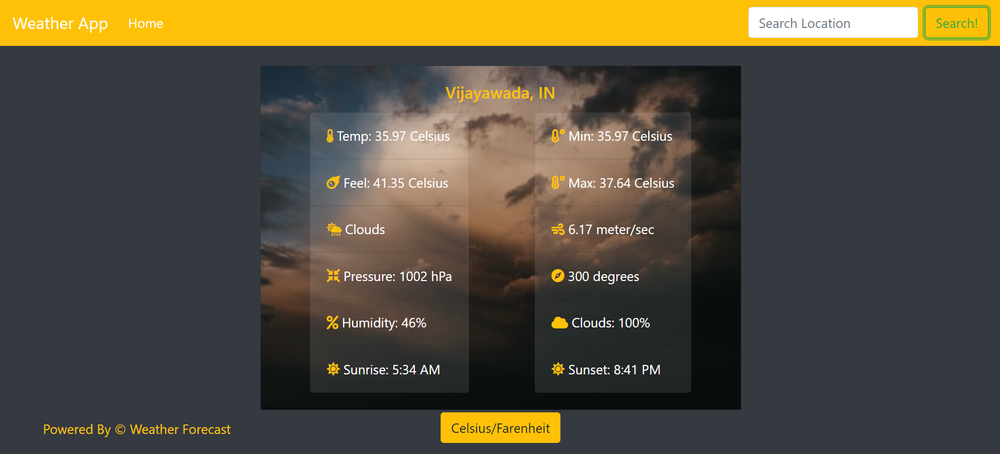
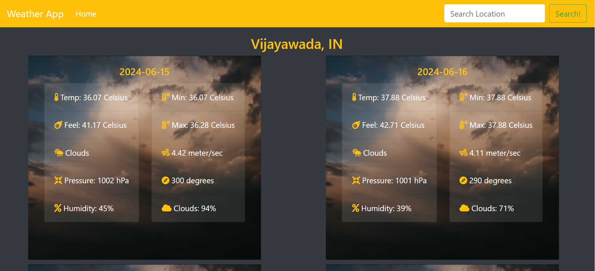

# WeatherApp

>  A weather app that pulls from the OpenWeatherMap API to allow users to search for and view the forecast in cities worldwide. Built with JavaScript.

Landing Page:

Actual Weather:

5-Day Forecast:

Additional description about the project and its features.

## Built With

- HTML 
- CSS
- JAVASCRIPT
- NPM
- WEBPACK
- BOOTSTRAP
- GITHUB ACTIONS

## Live Demo

[Live Demo Link](https://sakethreddyt.github.io/WeatherApp/) :point_left:

## Getting Started
- Follow the live demo link and enjoy the site.

## 📝 License

This project is [MIT](lic.url) licensed.

<!-- MARKDOWN LINKS & IMAGES -->
<!-- https://www.markdownguide.org/basic-syntax/#reference-style-links -->
[contributors-shield]: https://img.shields.io/github/contributors/javitocor/Weather-App-JS.svg?style=flat-square
[contributors-url]: https://github.com/javitocor/Weather-App-JS/graphs/contributors
[forks-shield]: https://img.shields.io/github/forks/javitocor/Weather-App-JS.svg?style=flat-square
[forks-url]: https://github.com/javitocor/Weather-App-JS/network/members
[stars-shield]: https://img.shields.io/github/stars/javitocor/Weather-App-JS.svg?style=flat-square
[stars-url]: https://github.com/javitocor/Weather-App-JS/stargazers
[issues-shield]: https://img.shields.io/github/issues/javitocor/Weather-App-JS.svg?style=flat-square
[issues-url]: https://github.com/javitocor/Weather-App-JS/issues
